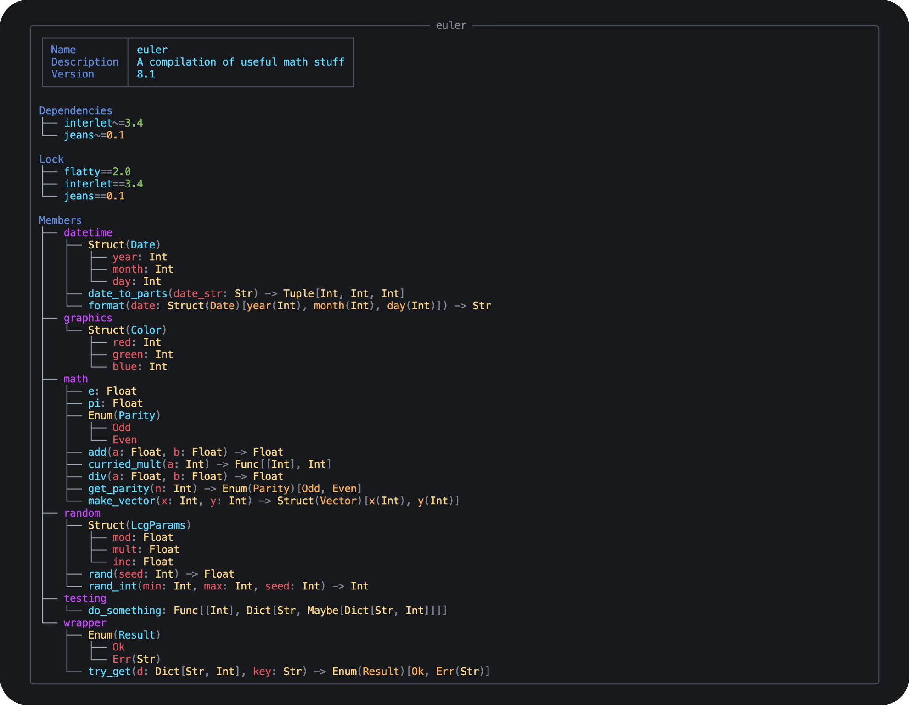

<div align="center">
  

  <h1>Myxa</h1>

  <p>
    <strong>Compatibility-aware package manager</strong>
  </p>

  <hr />
</div>

## About

Myxa enables developers to keep their package dependencies up to date and lowers the risk of unexpected breaking changes.

### How it works

Myxa tracks type signatures for everything in a package. When a package maintainer tries to publish a new version of their package, Myxa compares the package against previous published versions. When a breaking change is detected, `myxa publish` requires a major version bump.

Tracking type signatures also enables Myxa to support safe upgrading across major version boundaries. For large packages, most of the time breaking changes only affect a small proportion of users. If a user depends on feature X in their project, but only feature Y breaks, then `myxa update` will safely auto-upgrade to the latest compatible major version.

> Note: Myxa compatibility checks do not cover runtime behavior and are therefore imperfect. Package maintainers are still expected to manually bump major versions for runtime compatibility breaks.

## Sample

Running `mx info` shows an overview of a package. In this sample, the current package (euler) has taken a dependency on the interlet and jeans packages. The package flatty was pulled in as a dependency of interlet. Yellow version numbers indicate packages with newer major versions available in the index.

<div align="center">
  
</div>

Modules are in purple, types are in yellow, and package member names are in light blue and red. Primitive types like `Int`, `Str`, and `Float` are available as builtins. `Dict`, `Set`, `List`, and `Tuple` collection types are supported as well as `Struct` and `Enum`.

## Installation

Install using [uv](https://docs.astral.sh/uv)

```bash
uv sync
```

## Usage

```bash
# Initialize a new package
mx init <name> "<description>"

# Show package info
mx info

# Show package info for a specific version
mx info --version <version>

# Add a package dependency
mx add <dependency-name>

# Add a package dependency with a specific version
mx add <dependency-name> --version <version>

# Remove a package dependency
mx remove <dependency-name>

# Lock the package dependencies
mx lock

# Update all package dependencies to the highest compatible versions
mx update

# Check whether there are breaking changes
mx check

# Check whether there are breaking changes, comparing with a specific version
mx check --version <version>

# Check for any changes in a package
mx diff

# Check for any changes, comparing with a specific version
mx diff --version <version>

# Publish to the index
mx publish

# List all versions of all packages in the index
mx index

# List all packages in the index
mx index --no-versions

# List all versions of one package in the index
mx index --package <package_name>
```

### Local Index

Myxa automatically creates a local package index file where published packages are stored. To keep your index file somewhere else you can use the `MYXA_INDEX` environment variable. The recommended filename is `index.json`.

```bash
export MYXA_INDEX="path/to/index.json"
```

## Potentially upcoming features

- Upgrade across major versions
- Type references and recursive types
- Optional function parameters
- Dev dependencies/groups/extras
- Specifying extra indexes in package metadata
- Integration with actual code
- Different upgrade behavior for libraries and applications
- Greater than or equal to constraints
- Upper bounds

## Versioning

Myxa keeps things simple and has only two version slots that represent breaking and non-breaking changes. For ease of communication and at the risk of angering the semver zealots, these are named "major" and "minor" versions.

## Package name

Myxa is named after the slime mold _Myxogastria_, the Ancient Greek word μύξα (_myxa_), meaning "mucus".
